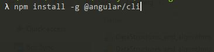

<!-- TOC -->

- [AngularPractice](#angularpractice)
    - [Angluar CLI](#angluar-cli)
    - [Create new application](#create-new-application)
    - [Development server](#development-server)
    - [Code scaffolding](#code-scaffolding)
    - [Build](#build)
    - [Running unit tests](#running-unit-tests)
    - [Running end-to-end tests](#running-end-to-end-tests)
    - [Further help](#further-help)

<!-- /TOC -->
# AngularPractice

This project was generated with [Angular CLI](https://github.com/angular/angular-cli) version 6.0.5.

[TOC](#toc)

## Angluar CLI
>Command line interface scafolding and maintaining angular applications.

## Create new application

## Development server

Run `ng serve` for a dev server. Navigate to `http://localhost:4200/`. The app will automatically reload if you change any of the source files. `--o` or `--open` is optional which launches browser.

[TOC](#toc)

## Code scaffolding

Run `ng generate component component-name` to generate a new component. You can also use `ng generate directive|pipe|service|class|guard|interface|enum|module`.

[TOC](#toc)

## Build

Run `ng build` to build the project. The build artifacts will be stored in the `dist/` directory. Use the `--prod` flag for a production build.

[TOC](#toc)

## Running unit tests

Run `ng test` to execute the unit tests via [Karma](https://karma-runner.github.io).

[TOC](#toc)

## Running end-to-end tests

Run `ng e2e` to execute the end-to-end tests via [Protractor](http://www.protractortest.org/).

[TOC](#toc)

## Further help

To get more help on the Angular CLI use `ng help` or go check out the [Angular CLI README](https://github.com/angular/angular-cli/blob/master/README.md).

[TOC](#toc)
